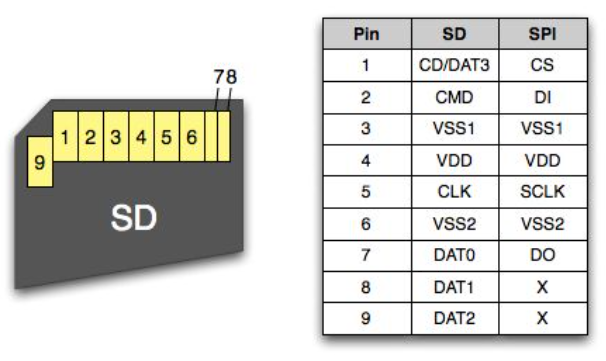

# DayCalendar 3.0

[A monument to the thing that is gone.](history/readme.md)

## Prepare hardware


See [hardware](hardware/readme.md)

## Prepare the SD card



### Stage 0. Create environment

Tested on Python 3.13.

**Windows**
```
C:\TOOLS\python313\python.exe -m venv .venv
.venv\Scripts\activate
pip install -r requirements.txt
```

**Linux**
```
python3 -m venv .venv
source .venv/bin/activate
pip install -r requirements.txt
```

Check `settings.py` for directory names and other settings.

### Stage 1. Fill the image list from Wikipedia's ["Picture of the day"](https://en.wikipedia.org/wiki/Wikipedia:Picture_of_the_day)

[English POTD](https://en.wikipedia.org/wiki/Wikipedia:Picture_of_the_day/Archive)

[Ukrainian POTD](https://uk.wikipedia.org/wiki/Шаблон:Potd/2019-01)

```
python run_grab_wiki.py
```
Fills the **db** directory with JSON files.

### Stage 2. Load color images from the Wikipedia site

```
python run_download_images.py
```
Fills the **cache** folder with images.

### Stage 3. Edit the collected database

#### 3.1 Create cached BMP images with different enhancement modes applied, for later review

```
python run_make_bmps.py
```
Fills the **bmpcache** folder.

#### 3.2 Update the **rank** and **enhance** parameters for all images

```
python run_viewer.py
```

See the web server [UI description](viewer/readme.md).

### Stage 4. Copy the finished red-black-white BMPs to use as the calendar's top part

```
python run_make_tops.py
```
Fills the **bmp** folder with the converted images.

See the [MIN_RANK](settings.py) parameter.

### Stage 5. Create red-black-white BMPs with day information for the calendar's bottom part

```
python run_make_bottoms.py
```
Fills the **days** folder with the day images.

See the [CALENDAR_YEARS_COUNT](settings.py) parameter.

### Stage 6. Copy the calendar data from the `sdcard` directory to an SD card

The essential artifacts are the **bmp** and **days** folders, plus the **readme.txt** and **readme.bmp** files.

The SD card must be **FAT32** formatted.