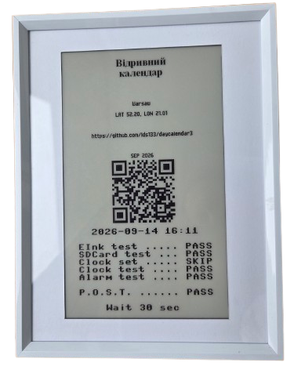

# Hardware

1. [Waveshare 3-color e-ink panel](https://www.waveshare.com/wiki/7.5inch_HD_e-Paper_HAT)
2. [Raspberry Pi Pico 2 board](https://www.raspberrypi.com/documentation/microcontrollers/pico-series.html#pico2)
3. SD card adapter or module
4. DS3231 RTC module


# Wiring

| PICO2 | E-Ink | SD Card | DS3231 | Note                |
|-------|-------|---------|--------|---------------------|
| GP10  | SCK   |         |        | SPI1                |
| GP11  | TX    |         |        | SPI1                |
| GP12  | RX    |         |        | SPI1, not used      |
| GP13  | CS    |         |        | SPI1                |
| GP14  | DC    |         |        |                     |
| GP15  | RST   |         |        |                     |
| GP9   | BUSY  |         |        |                     |
| GP3   | POWER |         |        | Not used            |
| GP21  |       |         | SCL    | I2C0                |
| GP20  |       |         | SDA    | I2C0                |
| GP22  |       |         | SQW    | Alarm interrupt     |
| GP19  |       | TX      |        | SPI0                |
| GP18  |       | SCK     |        | SPI0                |
| GP17  |       | CS      |        | SPI0                |
| GP16  |       | RX      |        | SPI0                |


- E-ink is powered at 3.3V.
- Clock is powered at 5V.
- SD card is powered at 3.3V.
- The SD card is wired directly through an SD-to-microSD adapter.
- The length of the wires connecting the SD card data should be kept to a minimum.
- Keep in mind that not all SD cards support SPI mode.

# Firmware

1. Flash the Pico with MicroPython.
2. Copy the `*.py` files from the **micropython** folder to the board.
3. Insert the prepared SD card.
4. Reset the board.

Tested on **MicroPython v1.29.0 (2026-08-24), Raspberry Pi Pico 2 with RP2350**.

## Expected SD card structure

The card maust be formatted as FAT32.
The root directory contains the following items:

- `days/` — stores generated daily bitmap images organized by year.
- `bmp/` — stores pictures as bitmap images organized by month and day.
- `readme.bmp` — a bitmap to be shown on startup.


```text
root/
├── days/
│   ├── YYYY/
│   │   ├── day_YYYY-MM-DD.bmp
│   │   ├── day_YYYY-MM-DD.bmp
│   │   └── ...
│   ├── YYYY/
│   └── ...
├── bmp/
│   ├── MM-DD/
│   │   ├── image1.bmp
│   │   ├── image2.bmp
│   │   └── ...
│   ├── MM-DD/
│   └── ...
└── readme.bmp
```


| Location | Resolution |
|----------|------------|
| bmp/MM-DD/*.bmp | 384 × 426 | 
| days/YYYY/day_YYYY-MM-DD.bmp | 384 × 216 |
| readme.bmp | 384 × 426 |

All image files use the 3-colour paletted Windows BMP format. The image template generation can be found in the [template.py](../draw/template.py) file.

Examples:

Image file [uk2020-r03.bmp](doc/uk2020-r03.bmp)

Day file [day_2026-01-03.bmp](doc/day_2026-01-03.bmp)

Readme file [readme.bmp](doc/readme.bmp)

## Setting the clock

To set the clock, create a **clock.txt** file in the SD card's root folder, with the first line in the format `YYYY-MM-DD HH:MM`. The file is read during POST, and deleted once the new time is set.

Example: [clock.txt](doc/clock.txt)


## The firmware loop

The firmware runs a built-in POST (power-on self-test). If it passes, setup information is displayed for 30 seconds; if it fails, the firmware halts.



During the main loop, the firmware reads the day's info from the matching file in the **days** folder and pairs it with a random image from the corresponding month-day subfolder in the **bmp** folder. The image is changed at 00:00, 12:00, and 18:00.

## Onboard LED

The onboard LED is lit while the firmware is running and off while it's asleep. If it stays lit for more than a couple of minutes, the firmware has likely stalled. A blinking LED also indicates a problem.