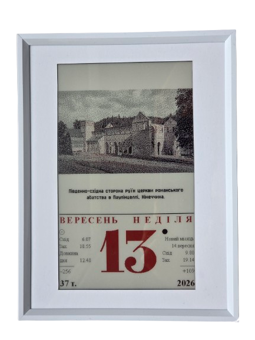
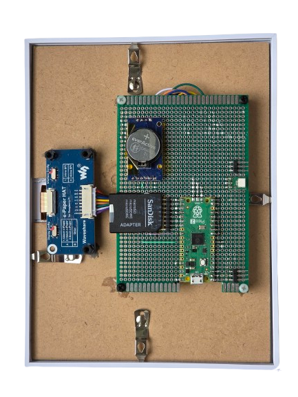
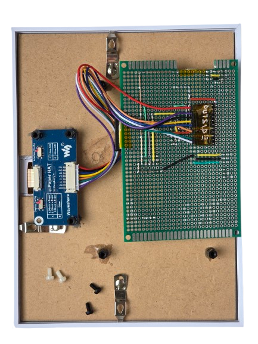

# Hardware

1. [Waveshare 3 color eink panel](https://www.waveshare.com/wiki/7.5inch_HD_e-Paper_HAT)
2. [Raspberry Pi pico 2 board](https://www.raspberrypi.com/documentation/microcontrollers/pico-series.html#pico2)
3. SD card adapter or module
4. DS3231 RTC Module

# Wiring

|PICO2| EINK  | SD Card| DS3231 | Note |
|-----|-------|--------|--------|------|
|GP10 | SCK   |        |        |SPI1  | 
|GP11 | TX    |        |        |SPI1  | 
|GP12 | RX    |        |        |SPI1, Not used  | 
|GP13 | CS    |        |        |SPI1  | 
|GP14 | DC    |        |        |      | 
|GP15 | RST   |        |        |      | 
|GP9  | BUSY  |        |        |      | 
|GP3  | POWER |        |        |Not used | 
|GP21 |       |        | SCL    |I2C0  | 
|GP20 |       |        | SDA    |I2C0  | 
|GP22 |       |        | SQW    |Alarm interrupt  | 
|GP19 |       | TX     |        |SPI0  | 
|GP18 |       | SCK    |        |SPI0  | 
|GP17 |       | CS     |        |SPI0  | 
|GP16 |       | RX     |        |SPI0  | 

Eink powered 3.3v

Clock powered 5v

Direct connection used to the SD cards pint through SDCard-to-MicroSDCard adapter.

# Firmware

1. Flash the pico with micropython.
2. Copy *.py files from **micropyton** folder to the board.

Tested on **MicroPython v1.29.0 on 2026-08-24; Raspberry Pi Pico2 with RP2350**

