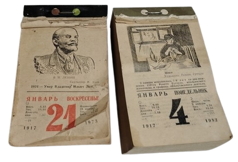
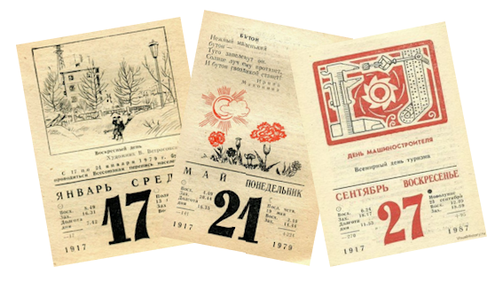

The text below is firmly grounded in a particular cultural and historical context, and does not contain any technical information.

# Пам’ятник втраченому

*Насправді, воно не зникло повністю. Сам предмет ще може десь існувати - збережений у чиїйсь кухні, на горищі, у шухляді чи в забутій коробці. Але він зник із мого життя, а разом із ним зник маленький фрагмент світу, в якому я виріс. Тож це не стільки пам’ятник предмету, скільки дитячим спогадам - фактурі повсякденного життя, яка вже не існує.*

Майже на кожній пристойній радянській кухні була особлива річ: відривний календар на рік.

Надрукований на жовтуватому папері дешевим способом, грубо, чорною та червоною фарбами. Кожен день мав своє невелике зображення: цікавий факт, портрет, свято або пам’ятну подію.

У радянському календарі свят було безліч - майже на кожен день року. Були День металурга, День Колгоспника та незліченна кількість інших професійних і неофіційних дат. До календаря могли потрапляти й свята інших країн, якщо вони вважалися ідеологічно доречними. Наприклад, можна було згадувати й святкувати День Паризької комуни. Такі дати часто виділялися червоним кольором; звичайні дні залишалися чорними.

Щоранку відривали маленький шматочок року.

Сам день зникав, але сторінка календаря не обов’язково ставала сміттям. На зворотному боці був ще один шар інформації, зазвичай пов’язаний із зображенням: історична замітка, факт, біографія, пояснення якоїсь події чи традиції. Прожитий день перетворювався на щось інше - маленький фрагмент знання.

І якщо цей фрагмент здавався достатньо цінним, його не викидали.

Починалося його друге життя.

Картка могла залишитися на кухонному столі, опинитися в книзі, на стіні, на полиці чи в кишені. Календар повільно розчинявся в домашньому просторі. Його дні переставали бути послідовністю і ставали розкиданими фрагментами - шматочками паперу, що несли в собі частинки історії, знання, ідеології та пам’яті

Це робить відривний календар таким упізнаваним артефактом радянської епохи. Він був звичайним, недорогим і майже непомітним у своїй повсякденності. І все ж він тихо займав простір між публічним і приватним: між офіційною історією та сімейним життям, між ідеологією та допитливістю, між плином часу та бажанням щось від нього зберегти.

Коли я побачив триколірний електронний папір e-ink із сірим тлом, великими розмитими пікселями та обмеженою палітрою, то одразу згадав хворобливу естетику радянського відривного календаря. Схожість була разючою. Я відчув, що маю надрукувати на цьому екрані календарну картку.

Я не маю особливого пієтету до радянських свят, тому замість них використав зображення з Вікіпедії: тварин, місця, краєвиди, фрагменти світу.

У результаті вийшло майже саме те, що я уявляв: знайомий предмет, відтворений за допомогою зовсім іншої технології.

